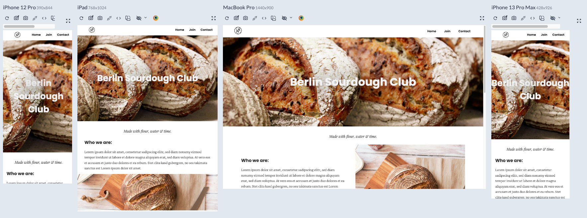

# Berlin-Sourdough-Club--Landing-Page

Small Landing Page with CSS & HTML.
Desktop first .

## Screenshots

## Demo
[https://lpphoto2024.netlify.app/](https://berlinsourdoughclub.netlify.app/)

## Appendix

I utilized JavaScript library for animating the buttons: https://scrollrevealjs.org/

then Remixicon for css:
https://remixicon.com/

and finally HTML.

## Note - Keep in mind
REMEMBER THAT IF YOUR LAYOUT IS 

DESKTOP FIRST: IN MEDIA QUERIES GO "max-width" ">"

MOBILE FIRST: IN MEDIA QUERIES GO "min-width"  "<"

## 🛠 Skills
Javascript, HTML, CSS.

## 🚀 About Me
I'm a Junior full stack developer.
